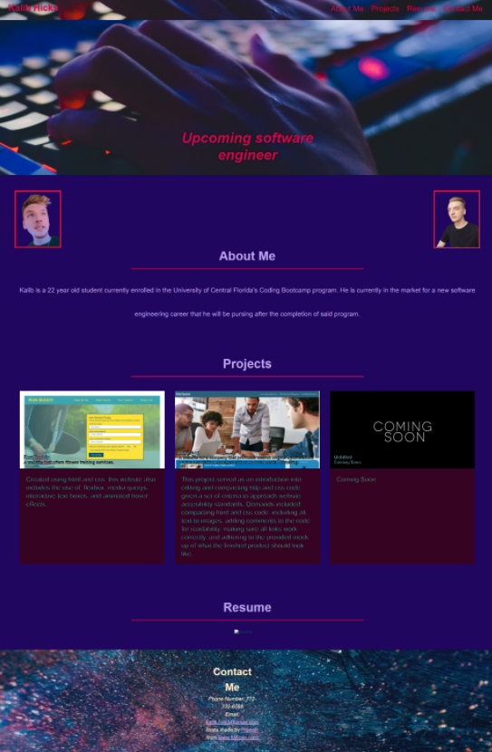

# Portfolio - Kalib Hicks
​
## Description 
​
Built with:
CSS
HTML

- - -

This project served as a demonstration of the abilities we've learned over the last few weeks regarding css and html and applying those to creating our own website based portfolio.

Skills from this project include: managing a git repo, working with different branches in github, applying ideas and ceoncepts to a blank slate, and preparing career oppertunities through a strong web-based portfolio.

​- - -

​Project link: https://kalib-hicks.github.io/portfolio

## Usage

To navigate this website, there are clickable links to three different sections at the top right of the site. Clicking the logo on the top left will take you to the homepage. There are 3 external links in the project section that will open the project in a new tab. 

​
## Credits
​

tutorials & helpful links: 

- GoFullPage - Full Page Screen Capture: "Helped get full webpage screencaps" 
https://chrome.google.com/webstore/detail/gofullpage-full-page-scre/fdpohaocaechififmbbbbbknoalclacl
 
- Flaticon - "Provided faivcon" https://www.flaticon.com/

- Pexels - "Provided free stock images" https://www.pexels.com/

- Run-buddy2.0 "Provided a webpage outline that was used to guide the process of creating this webpage" https://kalib-hicks.github.io/run-buddy2.0
